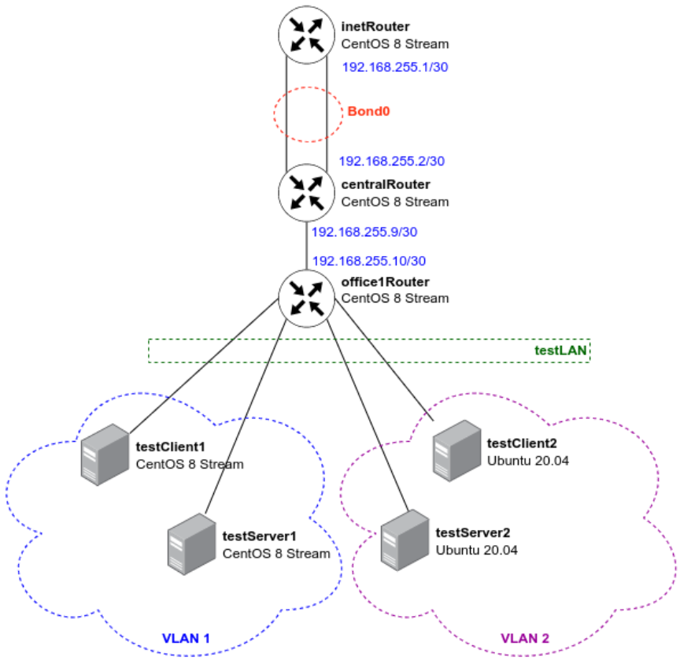

# Домашнее задание к занятию 37 - "Сетевые пакеты. VLAN'ы, LACP"

## Описание домашнего задания

в Office1 в тестовой подсети появляется сервера с доп интерфесами и адресами    
в internal сети testLAN:    
- testClient1 - 10.10.10.254     
- testClient2 - 10.10.10.254     
- testServer1- 10.10.10.1    
- testServer2- 10.10.10.1    

Равести вланами:    
testClient1 <-> testServer1    
testClient2 <-> testServer2    

Между centralRouter и inetRouter "пробросить" 2 линка (общая inernal сеть) и объединить их в бонд, проверить работу c отключением интерфейсов.

Схема стенда:    


---

## Выполнение     

Подготовлен [Vagrantfile](./Vagrantfile) c [ansible playbook](./ansible/provision.yml) разворачивающий данный стенд c ping-тестами.

Использование:    
```bash
vagrant up
```

---
