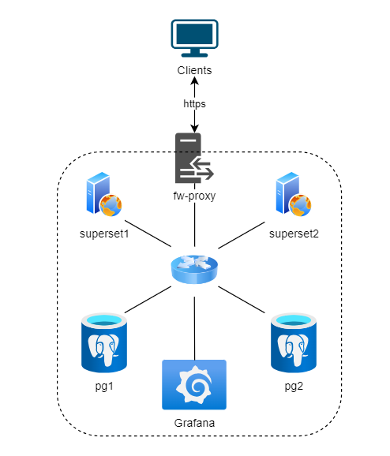

# ТЕМА ПРОЕКТА: «Проект значительной надежности»

## Описание серверов:

| VM Name   | Role & Services                         | Interfaces & IPs                                                |
|-----------|-----------------------------------------|------------------------------------------------                 |
| fw-proxy  | Фаервол/Реверс-прокси                   | - eth0: 192.168.0.100 (Bridged)<br>- eth1: 10.0.0.10 (Internal) |
| superset1 | Сервер Apache Superset                  | - eth0: 10.0.0.11 (Internal)                                    |
| superset2 | Сервер Apache Superset                  | - eth0: 10.0.0.12 (Internal)                                    |
| pg1       | PostgreSQL Server (Мастер)              | - eth0: 10.0.0.21 (Internal)                                    |
| pg2       | PostgreSQL Server (Реплика/Backup)      | - eth0: 10.0.0.22 (Internal)                                    |
| grafana   | Grafana, Prometheus, Loki, Alerting     | - eth0: 192.168.0.101 (Bridged)<br>- eth1: 10.0.0.31 (Internal) |


Структура проекта:
 
 
 ├── Vagrantfile  
 ├── ansible/  
 │   ├── roles/  
 │   │   ├── superset1/  
 │   │   │   └── tasks/  
 │   │   │       └── main.yml  
 │   │   ├── superset2/  
 │   │   │   └── tasks/  
 │   │   │       └── main.yml  
 │   │   └── pg1/  
 │   │       └── templates/  
 │   │           └── postgresql.conf.j2  
 │   ├── restart_prometheus_node_exporter.yml  
 │   └── other_scripts.sh  
 ├── configs/  
 │   ├── nginx/  
 │   ├── prometheus/  
 │   ├── grafana/  
 │   └── alertmanager/ 
 └── README.md  
 
 
В этой структуре:

Vagrantfile - файл для настройки виртуальной среды.
ansible/ - директория с Ansible ролями и задачами.
roles/ - подкаталог для хранения различных ролей Ansible, таких как superset1, superset2 и pg1.
tasks/ - подкаталог, содержащий задачи для каждой роли.
templates/ - подкаталог для шаблонов конфигурационных файлов, таких как postgresql.conf.j2.
configs/ - директория для хранения конфигураций различных сервисов, таких как Nginx, Prometheus и другие.
README.md - файл с описанием проекта.
Эта структура поможет организовать проект и упростить его поддержку и развитие.

---



Для развертывание тестового стенда на хостовой машине использовалось ПО:
1. Ubuntu 24.04.2 LTS
2. Oracle VM VirtualBox VM Selector v7.0.16_Ubuntu
3. Vagrant 2.4.6
4. ansible [core 2.18.6]

## Развертывание стенда:

1. Разворачиваем стенд, используя [Vagrantfile](Vagrantfile):
```
cd /vagrant
vagrant up
```
2. Выполняем playbook для настройки всех виртуальных машин:
```
cd /vagrant/ansible
ansible-playbook playbook.yml
```

## Аварийное восстановление:
**1. fw-proxy**

1.1 Удаляем виртуальную машину:
```
vagrant destroy fw-proxy
```
1.2 Создаем виртуальную машину:
```
vagrant up fw-proxy
```
1.3 Удаляем ssh ключ:
```
ssh-keygen -f "/home/user/.ssh/known_hosts" -R "10.0.0.10"
```
1.4 Запускаем плейбук:
```
ansible-playbook fw-proxy.yml
```

**2. superset1**  

2.1 Удаляем виртуальную машину:
```
vagrant destroy superset1
```
2.2 Создаем виртуальную машину:
```
vagrant up superset1
```
2.3 Удаляем ssh ключ:
```
ssh-keygen -f "/home/user/.ssh/known_hosts" -R "10.0.0.11"
```
2.4 Запускаем плейбук:
```
ansible-playbook superset1.yml
```

**3. superset2**  

3.1 Удаляем виртуальную машину:
```
vagrant destroy superset2
```
3.2 Создаем виртуальную машину:
```
vagrant up superset2
```
3.3 Удаляем ssh ключ:
```
ssh-keygen -f "/home/user/.ssh/known_hosts" -R "10.0.0.12"
```
3.4 Запускаем плейбук:
```
ansible-playbook superset2.yml
```

**4. pg1**  

4.1 Удаляем виртуальную машину:
```
vagrant destroy pg1
```
4.2 Создаем виртуальную машину:
```
vagrant up pg1
```
4.3 Удаляем ssh ключ:
```
ssh-keygen -f "/home/user/.ssh/known_hosts" -R "10.0.0.21"
```
4.4 Запускаем плейбук:
```
ansible-playbook pg1.yml
```
4.5 Восстанавливаем репликацию:
```
ansible-playbook replication.yml
```
4.6 Проверка репликации:
```
vagrant ssh pg2
sudo -u postgres psql
\c gate
SELECT * FROM gate01.event;
```

**5. pg2**  

5.1 Удаляем виртуальную машину:
```
vagrant destroy pg2
```
5.2 Создаем виртуальную машину:
```
vagrant up pg2
```
5.3 Удаляем ssh ключ:
```
ssh-keygen -f "/home/user/.ssh/known_hosts" -R "10.0.0.22"
```
5.4 Запускаем плейбук:
```
ansible-playbook pg2.yml
```

**6. grafana**  

6.1 Удаляем виртуальную машину:
```
vagrant destroy grafana
```
6.2 Создаем виртуальную машину:
```
vagrant up grafana
```
6.3 Удаляем ssh ключ:
```
ssh-keygen -f "/home/user/.ssh/known_hosts" -R "10.0.0.31"
```
6.4 Запускаем плейбук:
```
ansible-playbook grafana.yml
```